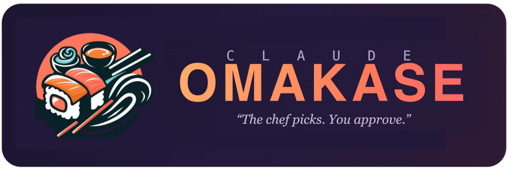

<!-- ────────────────────────────  HERO  ──────────────────────────── -->

<p align="center">
  
</p>

<p align="center">
  An MCP server that turns Claude into a <strong>proactive skill curator</strong>.<br/>
  It notices when you keep doing the same thing by hand — then offers the right skill.<br/>
  No searching. No docs. Just say yes or no.
</p>

<p align="center">
  <a href="https://www.npmjs.com/package/claude-omakase"></a>
  <a href="https://github.com/gyuch-an02/claude-omakase/actions/workflows/ci.yml"></a>
  <a href="LICENSE"></a>
  
  
</p>

<p align="center">
  <a href="#install"><b>Install</b></a> ·
  <a href="#how-it-works"><b>How it works</b></a> ·
  <a href="docs/ai-protocol.md"><b>AI protocol</b></a>
</p>

<!-- ──────────────────────────────────────────────────────────────── -->

```
   Claude Code
   ┌────────────────┐           ┌──────────────────────┐
   │ omakase-chef   │           │ claude-omakase MCP   │
   │ SKILL.md       │ calls ──▶ │ server (stdio)       │
   │ (the behavior) │           │ (registry + install) │
   └────────────────┘           └──────────────────────┘
                                           │
                                           │ fetched at build time
                                           ▼
   ┌─────────────────────────────────────────────────┐
   │ Daily federated catalog                         │
   │ ├── handpicked/        verified seeds + overlay │
   │ ├── skillsmp           public marketplace       │
   │ └── github-skills      GitHub SKILL.md search   │
   └─────────────────────────────────────────────────┘
```

## How it works

1. **You install the MCP server** — one `npx` command added to your MCP host config.
2. **Claude watches** — the bundled `omakase-chef` skill instructs Claude to monitor your workflow in the background.
3. **Claude notices** — after you repeat the same kind of manual task three times, Claude surfaces the right skill from the catalog.
4. **You approve** — Claude installs it to `~/.claude/skills/` and it's active next session.

First time? Claude greets you with a **starter pack** of universally useful skills so you're not starting from zero.

**Search that speaks your language.** `find_skill` ranks the catalog by keyword **plus LLM-generated synonyms in both English and Korean**, then returns the top candidates and lets **Claude rerank them by reading the descriptions** — so a query like `웹사이트 크롤링` or "scrape a site" both land on the right web-scraping skill, even when its description is in the other language. Search only has to surface the answer somewhere in the top few; Claude (already in the loop) picks the best fit — no extra model at serving time.

## Install

```bash
# 1. Install the omakase-chef skill
npx -y -p claude-omakase claude-omakase-install

# 2. Add the MCP server to your Claude Code config
claude mcp add omakase -- npx -y claude-omakase
```

**Requirements:** Node.js 20+, Claude Code (or another MCP host that supports stdio servers).

That's it. Restart your Claude session and the chef is active.

<details>
<summary>Manual MCP config (Claude Desktop or other hosts)</summary>

Add this to your MCP host config file and restart the host:

```json
{
  "mcpServers": {
    "omakase": {
      "command": "npx",
      "args": ["-y", "claude-omakase"]
    }
  }
}
```

</details>

## What Claude does for you

Once registered, these things just happen:

| Situation | Claude does |
|---|---|
| You summarize three PRs in one session | Offers to install `pr-summarizer` |
| You mention "I always have to do X by hand" | Searches for a skill that covers X |
| You ask "what can I install?" | Runs `recommend_skills` against your profile |
| No skills installed yet | Shows the starter pack |
| No catalog match found | Drafts a new `SKILL.md` tailored to your task using MCP sampling |

You can also be explicit: *"I have a recurring task that doesn't have a skill yet"* → Claude calls `propose_new_skill`, writes a draft SKILL.md to `~/.claude/skills/`, and iterates with you until it's right.

## Use cases

Concrete, end-to-end walkthroughs of what Omakase actually does.

### 1. First session — onboarding from zero

```
You:     (start a new Claude session, no skills installed)
Claude:  New here — want to set up a starter pack? I'll pop up a picker.
         → [native checkbox dialog appears]
            [x] Quick Review     — one-line, severity-tagged diff feedback
            [x] Understand Anything — deep explanations that lead with WHY
            [ ] Grill Me         — stress-test a plan by getting interviewed
            [ ] Write a Skill    — turn a workflow into a new skill
You:     (check two boxes, submit)
Claude:  Installed Quick Review and Understand Anything to ~/.claude/skills/. Active next session.
```

On clients with MCP elicitation (e.g. Claude Code), `recommend_skills` shows a **real interactive checkbox dialog** and installs exactly what you check — no typing, no parsing. The same tool drives this for both a brand-new user (the full pack) and a returning user with gaps (just the missing staples). On clients without elicitation it says so and returns the skills as a Markdown checklist for you to pick from.

### 2. Repeated manual work — proactive nudge

```
You:     (run `git diff`, review by hand; repeat across three PRs in one session)
Claude:  You've reviewed three diffs by hand this session. There's a Quick Review skill
         that gives one-line severity-tagged feedback — want me to install it?
You:     yes
Claude:  Done. Say "review this diff" next session to use it.
```

### 3. Intent in your prompt — suggestion without asking

```
You:     I need to automate browser testing across Chrome and Firefox
Claude:  That lines up with a browser-testing skill in the catalog (not installed yet) —
         want me to add it? (otherwise I'll just help directly)
```

### 4. Nothing matches — draft a new skill

```
You:     I keep reformatting our weird internal changelog format by hand
Claude:  No catalog skill covers that. Want me to draft one? I'll write a SKILL.md
         tailored to your changelog format and we'll iterate.
```

### 5. Manage what you've installed

```bash
npx claude-omakase tui
```

An interactive terminal app to **list** installed skills, **health-check** them
(missing `SKILL.md`? missing receipt? update available?), **update** them from the
catalog, and **remove** them — all with arrow keys and checkboxes. See
[Manage your skills](#manage-your-skills) below.

## Starter pack

When you have no skills installed, `recommend_skills` returns four universally useful skills:

| Skill | What it does |
|---|---|
| **Grill Me** | Stress-tests your plans — Claude interviews you relentlessly, one hard question at a time |
| **Understand Anything** | Deep explanations of code, systems, or concepts — leads with WHY, not HOW |
| **Write a Skill** | Turns any recurring workflow into a reusable Claude skill |
| **Quick Review** | Fast, severity-tagged code review (`🔴 bug`, `🟡 perf`, `🔵 style`) — no praise, no fluff |

Install any of them: *"Install the Grill Me skill"* → Claude calls `install_skill("grill-me")`.

## MCP tools

| Tool | Description |
|---|---|
| `find_skill` | Search the catalog by task description (keyword + EN/KO synonym match, IDF-weighted); returns the top-K candidates for Claude to rerank and pick from |
| `list_installed_skills` | List installed skills and install receipts |
| `install_skill` | Download and install a skill to `~/.claude/skills/<id>/` |
| `recommend_skills` | Ranked suggestions based on your profile, context, and install state. With no context it drives **starter-pack onboarding** — full pack for a new user, missing staples for a returning one — via a real checkbox picker (MCP elicitation), or a Markdown checklist on clients without it |
| `offer_skill` | Offer one found skill with an interactive **Install / Not now / Never recommend** picker (MCP elicitation); "never" blocks it from future `find_skill`/`recommend_skills` |
| `uninstall_skill` | Remove `~/.claude/skills/<id>/` and its install receipt (idempotent) |
| `update_skill` | Re-download a skill's files from the catalog |
| `doctor_skills` | Health report per skill: SKILL.md present? receipt present? in catalog? version match? |
| `set_profile` | Save your role, languages, and tools so recommendations improve over time |
| `propose_new_skill` | Draft a new SKILL.md from scratch using MCP sampling |

## Manage your skills

A terminal UI for the day-to-day lifecycle, no Claude session required:

```bash
npx claude-omakase tui      # or: omakase tui
```

It shows a health dashboard for every installed skill and lets you act on them:

```
┌  🍱  Claude Omakase — skill manager
│
◇  3 installed · 2 healthy · 1 need attention ───────────╮
│       Skill                SKILL.md   Receipt  Catalog │
│   ──────────────────────────────────────────────────── │
│   ✅  quick-review         ✓          ✓        ✓       │
│   🔄  grill-me             ✓          ✓        update! │
│   ⚠️  understand-anything  ✗ missing  ✓        ✓       │
╰────────────────────────────────────────────────────────╯
│
◇  What would you like to do?
│  ● Re-run health check
│  ○ Update skill(s) from catalog
│  ○ Remove skill(s)
│  ○ Quit
```

- **Health check** — flags skills with a missing `SKILL.md`, a missing install receipt, or a newer version available in the catalog.
- **Update** — re-downloads selected skills' files from the catalog (multi-select).
- **Remove** — deletes selected skills and their receipts, with a confirmation prompt.

The same operations are available to Claude as the `doctor_skills`, `update_skill`, and `uninstall_skill` MCP tools.

## Proactive hooks (optional)

Three opt-in [Claude Code hooks](https://docs.claude.com/en/docs/claude-code/hooks) make discovery deterministic instead of relying on Claude noticing on its own. The installer copies them to `~/.claude/hooks/omakase/` (a stable path), but **never registers them for you** — you opt in by pasting the snippet it prints into your `settings.json`.

| Hook | Event | What it does |
|---|---|---|
| `omakase-session-start.mjs` | `SessionStart` | At the start of a fresh session (`startup`/`clear`, not resume), tells Claude to run the chef's onboarding routine now — so new users get the starter pack without asking. Fires at most once per cooldown window. |
| `omakase-repetition.mjs` | `PostToolUse` (Bash + edits) | Tracks command workflows (single commands **and** multi-step chains via n-gram detection) **and repeated edits to the same file** (`edit:<name>`, counted once per session) in one **cross-session** file with timestamps; when a task recurs 3× within a rolling window, nudges Claude to find a matching skill. Primitive tools (`grep`, `cut`, `find`, …) and VCS/build plumbing (`git status`, `npm run`, `gh pr`, …) are filtered out, so it fires on real *tasks*, not on the commands you run to do them. Stays silent if no catalog is available. |
| `omakase-suggest.mjs` | `UserPromptSubmit` | Matches each prompt against the catalog; if a not-yet-installed skill clearly fits, suggests it once per session (with a cooldown). |

Register them in your Claude Code `settings.json` (the installer prints this block with your real paths filled in):

```json
{
  "hooks": {
    "SessionStart": [
      { "hooks": [
        { "type": "command", "command": "node ~/.claude/hooks/omakase/omakase-session-start.mjs" }
      ] }
    ],
    "PostToolUse": [
      { "matcher": "Bash|Edit|Write|MultiEdit|NotebookEdit", "hooks": [
        { "type": "command", "command": "node ~/.claude/hooks/omakase/omakase-repetition.mjs" }
      ] }
    ],
    "UserPromptSubmit": [
      { "hooks": [
        { "type": "command", "command": "node ~/.claude/hooks/omakase/omakase-suggest.mjs" }
      ] }
    ]
  }
}
```

Tunable via env vars: `OMAKASE_SESSION_COOLDOWN_HOURS` (default 24; set `0` to greet on every startup), `OMAKASE_REPETITION_THRESHOLD` (default 3), `OMAKASE_REPETITION_WINDOW_DAYS` (default 14), `OMAKASE_SUGGEST_THRESHOLD` (default 5), `OMAKASE_SUGGEST_COOLDOWN` (default 3 prompts). All are local-only — no network, no telemetry.

## Catalog

The catalog is federated from multiple sources in CI. Adapters generate entries, and a daily CI job opens a PR if the committed catalog drifts. Runtime serving reads the committed/cached catalog; it does not scrape upstream sources on the user's machine.

| Adapter | Source | Notes |
|---|---|---|
| `handpicked` | `handpicked/*.json` in this repo | Manually audited, `verified: true` |
| `skillsmp` | [skillsmp.com](https://skillsmp.com) | Public marketplace, expanded daily in CI via category + intent seeds |
| `github-skills` | GitHub code search | Public `SKILL.md` files, requires `GITHUB_TOKEN` during catalog builds |

Only real Claude Code skills (entries with a resolvable `SKILL.md`) are kept — `build:catalog --probe` prunes anything that 404s. After federation, a build-time pass (`enrich:catalog`) asks an LLM for **English + Korean search synonyms** per skill and stores them on the entry, so search works in either language with no model at serving time.

Want to add a source? See `src/adapters/README.md` and run:

```bash
npm run scaffold:adapter -- <source-name>
```

## Privacy

Everything Omakase writes stays on your machine:

| Path | Contents |
|---|---|
| `~/.claude/skills/<id>/` | Installed skill files |
| `~/.config/claude-omakase/profile.json` | Your profile (role, languages, tools) |
| `~/.local/share/claude-omakase/installed/` | Install receipts |
| `~/.cache/claude-omakase/catalog.json` | Cached remote catalog, when `CLAUDE_OMAKASE_CATALOG_URL` is configured |

No telemetry. No accounts. Outbound calls happen only for configured remote catalog refresh and skill file downloads (when you approve an install).

## Trust & safety

Omakase installs third-party content into `~/.claude/skills/`, so it treats the
catalog as a supply-chain surface. Two things are **never** automated: marking an
entry `verified: true` (human audit only) and writing a skill to disk (you approve
every install). Catalog entries pass three automated gates — schema, install
resolvability, HTTPS-only sources — before they're trusted or merged.

Full trust boundary, the `verified` definition, auto-merge guardrails, and the
rollback path: [`docs/TRUST.md`](docs/TRUST.md).

## Develop

```bash
git clone https://github.com/gyuch-an02/claude-omakase
cd claude-omakase
npm install
npm run build              # compile TypeScript
npm run build:catalog -- --probe   # fetch adapters → catalog.json, drop dead SKILL.md URLs
npm run enrich:catalog     # (optional) add EN/KO search synonyms via an LLM endpoint
npm run typecheck          # type check without emitting
npm test                   # run all tests
```

Register your local build with Claude Code:

```bash
claude mcp add omakase -- node /path/to/claude-omakase/dist/server.js
```

## Contributing

All contributions are welcome — from first-timers to seasoned TypeScript developers.

**Good first issues:** look for the [`good first issue`](https://github.com/gyuch-an02/claude-omakase/issues?q=is%3Aissue+is%3Aopen+label%3A%22good+first+issue%22) label.

**Quick ways to contribute:**

- **New adapter:** `npm run scaffold:adapter -- <name>` → implement `fetch(): Promise<Entry[]>` → register in `src/adapters/index.ts` → PR.
- **New handpicked entry:** add a JSON file to `handpicked/` following the `Entry` shape in `src/types.ts`.
- **Bug or feature:** open an issue or PR — all contributions welcome.

See [`CONTRIBUTING.md`](CONTRIBUTING.md) for the full guide, including the PR checklist and local dev loop.

We follow the [Contributor Covenant](CODE_OF_CONDUCT.md). Please read it before participating.

## License

MIT. © 2026 Claude Omakase contributors.
